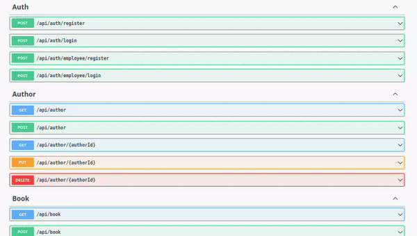

# Library System API

## Summary

- This is a **REST DEMO API** project for a library system.
- There is ***35*** endpoints in total, with over ***55*** **unit and integration** tests
- Uses a **PostgreSQL** database with **Entity Framework**
- **JWT** authentication and authorization - (User, Employee, Admin policies)
- Project is utilizing the **Clean Architecture**
- Features **Users, Employees, Books, Authors, Genres, Borrow System, Reviews**
- Features **searching** and **querying** with various filters
- Features **Email Notifications** on some endpoints.

## Endpoints Overview

In total there is about **35+** endpoints



**Check out each endpoint in detail [here.](endpoints.md)**

## Tests Overview

In total there is about **55+** tests, both **integration** and **unit** tests. I've tried to cover most edge cases with the integration tests.

**Integration Tests:**

``` bash
.
├── Endpoints
│   ├── AuthControllerTests.cs
│   ├── AuthorControllerTests.cs
│   ├── BookControllerTests.cs
│   ├── BookReviewControllerTests.cs
│   ├── BorrowControllerTests.cs
│   ├── EmployeeControllerTests.cs
│   ├── GenreControllerTests.cs
│   └── UserControllerTests.cs
├── Extensions 
│   ├── AuthorTestExtensions.cs
│   ├── BookReviewTestExtensions.cs
│   ├── BookTextExtensions.cs
│   ├── BorrowTestExtensions.cs
│   ├── EmployeeTestExtensions.cs
│   ├── GenreTestExtensions.cs
│   ├── JwtTestExtensions.cs
│   └── UserTestExtensions.cs
├── Middlewares
│   ├── EmployeeAuthenticationMiddlewareTests.cs
│   └── UserAuthenticationMiddlewareTests.cs
└── Server
    ├── TestServiceExtensions.cs
    └── WebAppFactory.cs
```

The Extensions folder is for helper extension methods that come in handy during testing. Server folder is where the testing server is defined.

**Unit Tests:**

```bash
.
└── Utilities
    ├── AuthenticationMiddlewareBaseTests.cs
    ├── JwtTests.cs
    └── PasswordHasherTests.cs
```

## Architecture Overview

This project utilizes a **Clean Architecture** paradigm. Which is very widely known for its scalability and its perfect for bigger sized projects.

```bash
├── LibrarySystem.Application // The Application Layer
│   ├── Core
│   │   ├── Attributes
│   │   ├── Emails
│   │   ├── Extensions
│   │   ├── Factories
│   │   └── Utilities
│   ├── Interfaces
│   │   ├── Emails
│   │   └── Services
│   └── Services
│       ├── Authors
│       ├── Books
│       ├── Borrows
│       ├── Genres
│       ├── Reviews
│       ├── Staffs
│       └── Users
├── LibrarySystem.Domain // The Domain/Core Layer
│   ├── Dtos
│   │   ├── Authors
│   │   ├── Books
│   │   ├── Borrows
│   │   ├── Employees
│   │   ├── Genres
│   │   ├── Messages
│   │   ├── Responses
│   │   ├── Reviews
│   │   └── Users
│   ├── Entities
│   │   └── Relationships
│   ├── Exceptions
│   │   ├── BadRequest
│   │   └── NotFound
│   └── Interfaces
│       ├── Emails
│       ├── Repositories
│       └── Utilities
├── LibrarySystem.EmailService
├── LibrarySystem.Infrastructure // The Infrastructure Layer
│   ├── Factories
│   ├── Messages
│   │   ├── Borrows
│   │   └── Html
│   └── Persistence
│       ├── Extensions
│       ├── Migrations
│       └── Repositories
├── LibrarySystem.Presentation // The Presentation Layer
│   ├── Controllers
│   ├── Extensions
│   ├── Middlewares
│   └── Properties
└── LibrarySystem.Tests
    ├── Integration
    │   ├── Endpoints
    │   ├── Extensions
    │   ├── Middlewares
    │   └── Server
    └── Unit
        └── Utilities
```

## Notes

In this project i learned a lot about ASP.NET and specifically about API's. I've implemented various authentication middlewares and authorization policies, implemented the clean architecture paradigm, got better at writing integration tests, learned how to implement an **EMAIL** service and how to use the Razor Engine for custom email HTML. I've also got better at writing bussiness logic and implemented various features.
