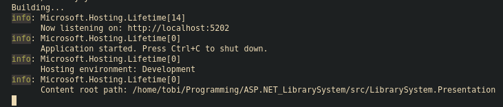
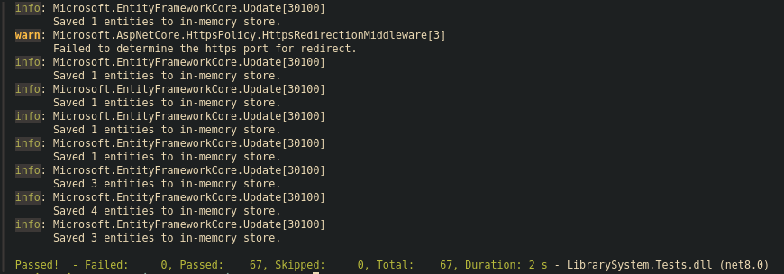
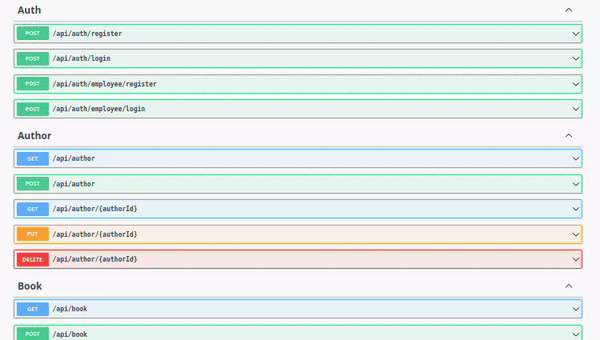

# Library System API

## Table of Contents

- **[Summary](#summary)**
- **[How To Build?](#how-to-build)**
- **[How To Run Tests?](#how-to-run-tests)**
- **[Endpoints Overview](#endpoints-overview)**
- **[Test Overview](#test-overview)**
  - **[Integration Tests](#integration-tests)**
  - **[Unit Tests](#unit-tests)**
- **[Architecture Overview](#architecture-overview)**
- **[Notes](#notes)**

## Summary

- This is a **REST DEMO API** project for a library system.
- There are **45 endpoints** in total, with over **80 unit and integration tests**.
- Uses a **PostgreSQL** database with **Entity Framework**.
- **JWT** authentication and authorization with User, Employee, and Admin policies.
- Follows **Clean Architecture**.
- Features include **Users, Employees, Books, Authors, Genres, Borrow System, Reviews**.
- Provides **search**, **recommendation**, and **querying** for books with various filters.
- Supports **Email Notifications** on some endpoints.

## How To Build?

You will need:

- `Dotnet SDK 8.0.*`
- `PostgreSQL`

Clone the repository into your desired folder:

```bash
git clone https://github.com/realtobi999/ASP.NET_LibrarySystem.git
```

Navigate to the presentation layer:

```bash
cd src/LibrarySystem.Presentation
```

Open `appsettings.json` in your editor and modify as follows:

```json
{
  "Logging": {
    "LogLevel": {
      "Default": "Information",
      "Microsoft.AspNetCore": "Warning"
    }
  },
  "AllowedHosts": "*",
  "ConnectionStrings": {
    "LibrarySystem": "Host=YOUR_HOST;Username=YOUR_USERNAME;Password=YOUR_PASSWORD;Database=YOUR_DATABASE_NAME"
  },
  "Jwt": {
    "Key": "YOUR_KEY",
    "Issuer": "YOUR_ISSUER"
  },
  "SMTP": {
    "Host": "YOUR_HOST",
    "Port": "YOUR_PORT",
    "Username": "YOUR_USERNAME",
    "Password": "YOUR_PASSWORD"
  }
}
```

Return to the **root** folder and run the project:

```bash
cd ../.. && make run
```

**OR** run it directly from the presentation layer:

```bash
dotnet run
```

**Expected Output:**



## How To Run Tests?

To run tests, use the following command in the **root** folder:

```bash
make test
```

**Expected Output:**



## Endpoints Overview

In total there are about **35+** endpoints.



**Check out each endpoint in detail [here.](./doc/endpoints.md)**

## Tests Overview

There are about **80+** tests, both **integration** and **unit** tests. Integration tests cover various edge cases.

### **Integration Tests:**

```bash
.
├── Endpoints
│   ├── AuthControllerTests.cs
│   ├── AuthorControllerTests.cs
│   ├── BookControllerTests.cs
│   ├── BookReviewControllerTests.cs
│   ├── BorrowControllerTests.cs
│   ├── EmployeeControllerTests.cs
│   ├── GenreControllerTests.cs
│   ├── UserControllerTests.cs
│   └── WishlistControllerTests.cs
├── Helpers
│   ├── AuthorTestExtensions.cs
│   ├── BookReviewTestExtensions.cs
│   ├── BookTextExtensions.cs
│   ├── BorrowTestExtensions.cs
│   ├── EmployeeTestExtensions.cs
│   ├── GenreTestExtensions.cs
│   ├── JwtTestExtensions.cs
│   ├── UserTestExtensions.cs
│   └── WishlistTestExtensions.cs
├── Middlewares
│   ├── EmployeeAuthenticationMiddlewareTests.cs
│   └── UserAuthenticationMiddlewareTests.cs
└── Server
    ├── TestServiceExtensions.cs
    └── WebAppFactory.cs
```

The `Extensions` folder contains helper extension methods for testing. The `Server` folder defines the testing server.

### **Unit Tests:**

```bash
.
├── Books
│   ├── BookCalculatorTests.cs
│   └── BookRecommenderTests.cs
├── Searchers
│   ├── AuthorSearcherTests.cs
│   ├── BookSearcherTests.cs
│   └── GenreSearcherTests.cs
├── Utilities
│   ├── AuthenticationMiddlewareBaseTests.cs
│   ├── HasherTests.cs
│   └── JwtTests.cs
└── Validators
    ├── BookReviewValidatorTests.cs
    ├── BookValidatorTests.cs
    ├── BorrowValidatorTests.cs
    └── WishlistValidatorTests.cs
```

## Architecture Overview

This project utilizes a **Clean Architecture** paradigm, ideal for scalability and larger projects.

```bash
.
├── LibrarySystem.Application // application layer
│   ├── Core
│   │   ├── Attributes
│   │   ├── Configuration
│   │   ├── Emails
│   │   │   └── Services
│   │   ├── Extensions
│   │   ├── Factories
│   │   ├── Mappers
│   │   ├── Utilities
│   │   └── Validators
│   └── Services
│       ├── Authors
│       ├── Books
│       ├── Borrows
│       ├── Genres
│       ├── Pictures
│       ├── Reviews
│       ├── Staffs
│       ├── Users
│       └── Wishlists
├── LibrarySystem.Domain // domain layer
│   ├── Dtos
│   │   ├── Authors
│   │   ├── Books
│   │   ├── Borrows
│   │   ├── Email
│   │   │   └── Messages
│   │   ├── Employees
│   │   ├── Genres
│   │   ├── Responses
│   │   ├── Reviews
│   │   ├── Users
│   │   └── Wishlists
│   ├── Entities
│   ├── Enums
│   ├── Exceptions
│   │   ├── Common
│   │   └── HTTP
│   └── Interfaces
│       ├── Common
│       ├── Emails
│       │   └── Borrow
│       ├── Factories
│       ├── Managers
│       ├── Repositories
│       └── Services
│           ├── Books
│           └── Services
├── LibrarySystem.Infrastructure // infrastructure layer
│   ├── Factories
│   ├── Messages
│   │   ├── Builders
│   │   └── Html
│   └── Persistence
│       ├── Extensions
│       ├── Migrations
│       └── Repositories
└── LibrarySystem.Presentation // presentation layer
    ├── Controllers
    ├── Extensions
    ├── Middlewares
    │   ├── Filters
    │   └── Handlers
    ├── Properties
    └── Services
```

## Notes

In this project, I learned a lot about ASP.NET, specifically about building APIs. I implemented various authentication middlewares, authorization policies, and the clean architecture design. I improved at writing integration tests, implemented an **EMAIL** service, learned how to use the Razor Engine for custom email HTML, and developed a stronger grasp of business logic and feature implementation.
